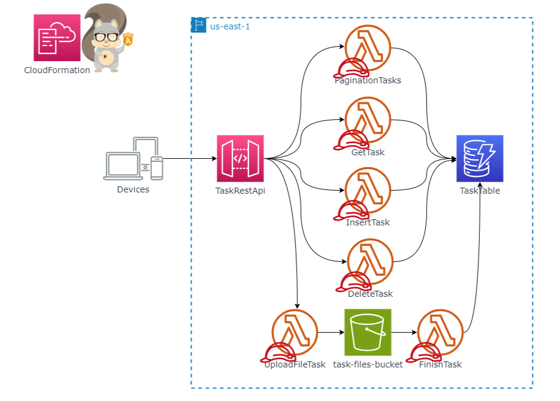

# 📝 CRUD Simple de Tareas con Servicios Serverless de AWS

Este proyecto tiene como objetivo la creación de un CRUD sencillo mediante el uso de tecnologías como AWS Lambda con Node.js, S3, API Gateway y DynamoDB. Para la gestión eficiente de la infraestructura del proyecto, se aprovecha AWS SAM, facilitando así la implementación y despliegue de la aplicación serverless en AWS.

La aplicación permite la gestión de tareas a través de una API REST, almacenando la información en una tabla de DynamoDB. Las tareas pueden ser creadas, consultadas, actualizadas mediante la carga de un archivo en S3, y eliminadas. Finalmente, la implementación y despliegue se llevan a cabo en una cuenta de AWS utilizando AWS SAM.

El propósito central de este proyecto es fomentar el aprendizaje, la práctica y la consolidación de conocimientos relacionados con la construcción y despliegue de aplicaciones serverless en la nube de Amazon Web Services.

## 🧱 Arquitectura del proyecto

La arquitectura del proyecto se basa en el siguiente diagrama:

<p align="center">
  
</p>

### Descripción de la arquitectura

La arquitectura del proyecto se basa en los siguientes servicios de AWS:

- **API Gateway:** Se trata de una API REST que expone los siguientes endpoints:

  - **POST /insert:** Permite la creación de una nueva tarea.
  - **POST /search:** Facilita la búsqueda de una tarea según su identificador.
  - **POST /pagination:** Lista las tareas de manera paginada.
  - **DELETE /delete:** Elimina una tarea mediante su identificador.
  - **POST /upload:** Permite la carga de un archivo a S3.

- **Lambda:** Son funciones que se ejecutan en respuesta a eventos generados por API Gateway. Las funciones específicas son:

  - **InsertTask:** Asociada al endpoint /insert.
  - **GetTask:** Asociada al endpoint /search.
  - **PaginationTasks:** Asociada al endpoint /pagination.
  - **DeleteTask:** Asociada al endpoint /delete.
  - **UploadFileTask:** Asociada al endpoint /upload.
  - **UpdateTask:** Actualiza una tarea en respuesta a una notificación de creación en S3.
  - **CommonCodeLayer:** Capa que contiene código compartido para las funciones:
    - **Dynamodb-utils:** Funciones para interactuar con DynamoDB.
    - **S3-utils:** Funciones para interactuar con S3.

- **DynamoDB:** Es una base de datos NoSQL utilizada para almacenar las tareas.

- **S3:** Almacena los archivos que son cargados a través del endpoint /upload.

- **AWS SAM:** Se utiliza para facilitar la gestión de la implementación y el despliegue de la aplicación, optimizando así el manejo de recursos y la configuración asociada.

### Servicos implicitos:

- **CloudFormation**: Gestiona la infraestructura del proyecto con código.
- **IAM**: Gestiona los permisos de los recursos del proyecto.
- **CloudWatch**: Gestiona el monitoreo y registro de los recursos del proyecto.
- **S3**: Almacena los archivos de código de las funciones Lambda.

## 🔨 Tecnologías utilizadas

- **Node.js v18**: Lenguaje de programación utilizado para el desarrollo de las funciones Lambda.
- **Middy**: Framework utilizado para la implementación de middlewares en las funciones Lambda.
- **AWS SAM**: Framework utilizado para la gestión de la infraestructura del proyecto con código.
- **Consola de AWS**: Consola web de AWS.
- **CLI de AWS**: Interfaz de línea de comandos de AWS.
- **AWS SDK for JavaScript v3**: SDK de AWS para Node.js.

## 👨🏼‍💻 Configuración del Entorno

### Instalación de Node.js

Para instalar Node.js en tu computadora, sigue las instrucciones de la [página oficial](https://nodejs.org/en/download/).

### Instalación de AWS SAM CLI

Para instalar AWS SAM CLI en tu computadora, sigue las instrucciones de la [página oficial](https://docs.aws.amazon.com/serverless-application-model/latest/developerguide/serverless-sam-cli-install.html).

### Configuración de las credenciales de AWS

Para configurar las credenciales de AWS en tu computadora, sigue las instrucciones de la [página oficial](https://docs.aws.amazon.com/cli/latest/userguide/cli-configure-quickstart.html).

## Estructura del Proyecto

```bash
.
├── src                                     # Código fuente del proyecto
│   ├── functions                           # Funciones Lambda
│   │   ├── DeleteTask                      # Función Lambda para eliminar una tarea
│   │   │   ├── src                         # Código fuente de la función
│   │   │   │    └── controller.js          # Controlador de la función
│   │   │   ├── handler.js                  # Handler de la función
│   │   │   └── package.json                # Archivo de dependencias de la función
│   │   ├── GetTask                         # Función Lambda para obtener una tarea
│   │   │   ├── src
│   │   │   │    └── controller.js
│   │   │   ├── handler.js
│   │   │   └── package.json
│   │   ├── InsertTask                      # Función Lambda para crear una tarea
│   │   ├── UpdateTask                      # Función Lambda para actualizar una tarea
│   │   ├── UploadFileTask                  # Función Lambda para subir un archivo a S3
│   │   └── PaginationTasks                 # Función Lambda para listar las tareas de forma paginada
│   └──layers                               # Capas de funciones
│       └── common-code                     # Capa para las funciones que contiene código compartido
│           ├── dynamodb-utils              # Funciones para interactuar con DynamoDB
│           │    ├── client.js              # Cliente de conexión a DynamoDB
│           │    ├── templates.js           # Plantillas de consultas para DynamoDB
│           │    ├── index.js               # Funciones para interactuar con DynamoDB
│           │    └── package.json           # Archivo de dependencias de la capa
│           └── s3-utils                    # Funciones para interactuar con S3
│                ├── client.js
│                ├── templates.js
│                ├── index.js
│                └── package.json
├── .gitignore                              # Archivo para ignorar archivos y carpetas
├── README.md                               # Este archivo
├── samconfig.toml                          # Archivo de configuración de SAM
└── template.yaml                           # Plantilla de SAM para creación de los recursos
```

## Despliegue del Proyecto

Antes de ejecutar el despliegue del proyecto, debes instalar las dependencias de las funciones Lambda y las capas de funciones. Para ello, ejecuta el siguiente comando dentro de la carpeta raíz de cada función y capa de funciones:

```bash
npm install
```

Para desplegar, asegurate de tener configuradas las credenciales de AWS en tu computadora y ejecuta los siguientes comandos en la carpeta raíz del proyecto:

```bash
sam build --parallel --cached
```

> **Nota:** El comando `sam build` compila el código fuente de las funciones Lambda y las capas de funciones, y empaqueta el código en un archivo zip que se almacena en la carpeta `.aws-sam/build`. Al añadir el parámetro `--parallel` se compilan las funciones en paralelo, lo que reduce el tiempo de compilación. Al añadir el parámetro `--cached` se utiliza el caché de compilación, lo que reduce aún más el tiempo de compilación. (Solo se compila el código que ha cambiado desde la última compilación).

```bash
sam deploy
```

> **Nota:** El comando `sam deploy` crea los recursos y despliega el código de las funciones Lambda y las capas de funciones en la cuenta de AWS. Al ejecutar este comando, se crea un archivo `samconfig.toml` que contiene la configuración del proyecto. Este archivo se utiliza para almacenar la configuración de SAM y se utiliza en los siguientes despliegues. Si deseas cambiar la configuración del proyecto, puedes editar este archivo o ejecutar el comando `sam deploy --guided` para volver a configurar el proyecto.

```bash
sam delete
```

> **Nota:** El comando `sam delete` elimina los recursos creados por SAM en la cuenta de AWS.

## Apreciaciones finales

A lo largo del desarrollo de este proyecto, se han identificado y abordado diversos aspectos cruciales para la implementación de aplicaciones serverless en AWS. A continuación, se enumeran algunos de estos puntos fundamentales:

- **Mantén las funciones pequeñas y especializadas:**<br>
  Es esencial configurar adecuadamente la asignación de recursos, como memoria y tiempo de ejecución, para cada función. Ajustar estos valores según las necesidades reales contribuye a optimizar el rendimiento y gestionar eficientemente los costos asociados.

- **Ajusta correctamente los recursos:**<br>
  Configura adecuadamente la asignación de recursos (memoria, tiempo de ejecución, RCU, WCU, etc.) para cada servicio. Ajusta estos valores según las necesidades reales para optimizar el rendimiento y los costos.

- **Manejo adecuado de errores:**
  Implementa un manejo de errores robusto en tus funciones Lambda. Registra información detallada sobre errores para facilitar la depuración, y utiliza mecanismos de reintento si es necesario. Esto mejora la tolerancia a fallos y la fiabilidad del sistema.

- **Optimiza el tamaño del paquete de despliegue y dependencias:**<br>
  La minimización del tamaño de los paquetes que se cargan en Lambda es crucial para reducir los tiempos de carga y mejorar la eficiencia del sistema. Eliminar dependencias y archivos innecesarios contribuye a este objetivo.

- **Usa capas de funciones:**<br>
  La utilización de capas de funciones es una práctica recomendada para compartir bibliotecas y código común entre varias funciones. Esto no solo reduce la duplicación de código, sino que también facilita la actualización de bibliotecas compartidas.

- **Reutilización de conexiones:**<br>
  Se sugiere reutilizar conexiones a recursos de AWS, como bases de datos, para reducir el tiempo de ejecución y mejorar la eficiencia del sistema.

- **Seguridad:**<br>
  La implementación de prácticas de seguridad es esencial. Esto incluye el uso adecuado de roles de IAM para limitar los privilegios y la aplicación de cifrado para proteger datos sensibles.

## Referencias

- [Node.js](https://nodejs.org/en/)
- [Middy](https://middy.js.org/)
- [AWS SAM](https://aws.amazon.com/serverless/sam/)
- [AWS SDK for JavaScript v3](https://docs.aws.amazon.com/AWSJavaScriptSDK/v3/latest/index.html)
- [Prácticas recomendadas para trabajar con funciones AWS Lambda](https://docs.aws.amazon.com/es_es/lambda/latest/dg/best-practices.html)

## Licencia

Este proyecto está bajo la Licencia MIT. Puedes consultar el archivo LICENSE para más información.
